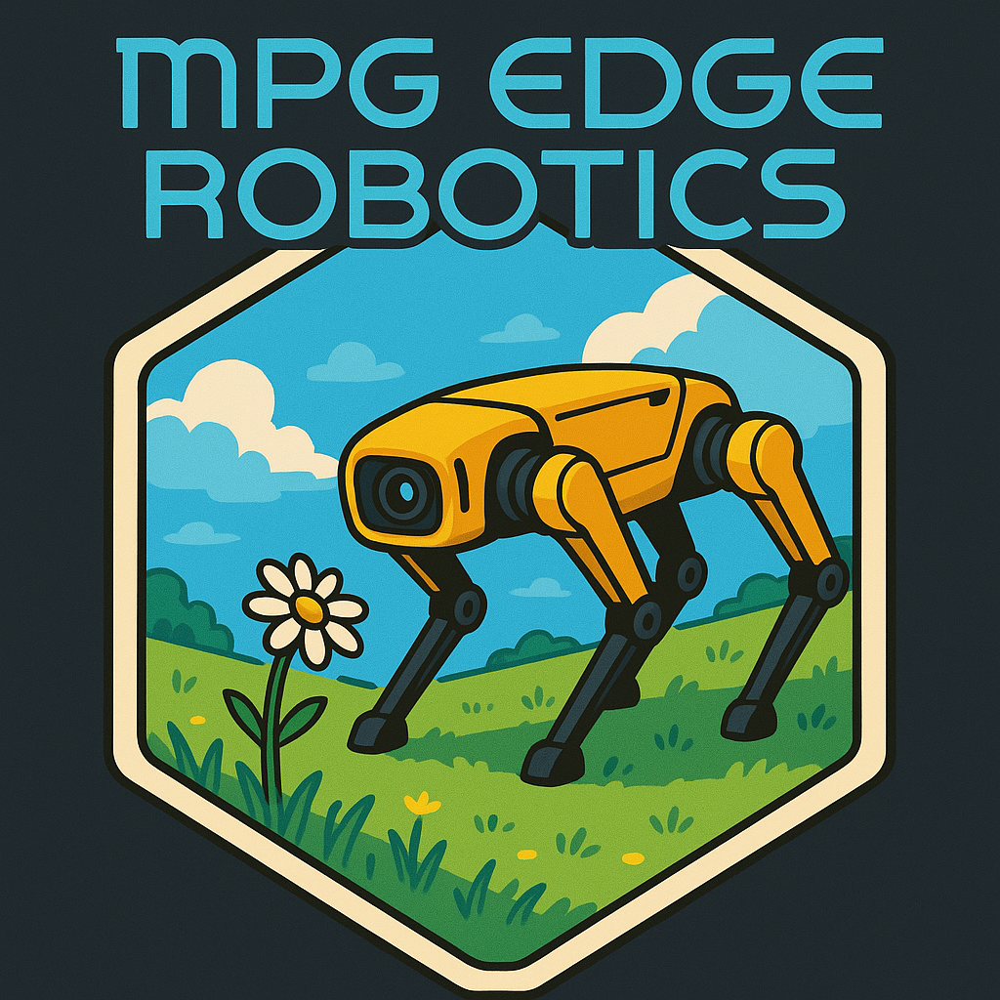

This project focuses on developing an AI edge device for environmental monitoring. Specifically, we conducte image inference using the DINOv2 model on a NVIDIA Jetson embedded device. A core feature of this project is the ability to precisely geotag captured images by synchronizing them with RTK (Real-Time Kinematic) GPS data.

## Project Structure

The repository contains the following key Python scripts:

*   `00_jetson_offline_inference.py`: Used for testing inference capabilities on the Jetson device with pre-existing images and the DINOv2 (base) model. This script helps in verifying the model and inference pipeline in an offline setting.
*   `01_jetson_online_inference.py`: Designed for testing inference on the Jetson device using a live camera feed. It also utilizes the DINOv2 (base) model for real-time image processing.
*   `02_pull_RTK_coordinates.py`: Demonstrates the process of retrieving highly accurate RTK coordinates from an external GNSS receiver.
*   `03_geotag_images.py`: Contains logic to synchronize the timestamps of images captured by the camera with the RTK coordinate data. This is crucial for accurate geotagging.
*   `04_online_inference_and_geotag.py`: An integrated script that combines online image inference with the geotagging process, allowing for real-time analysis and location stamping of images.

Additionally, there are two directories:

*   `data/`: Intended to store input data for the scripts, such as sample images, RTK log files, or other necessary resources.
*   `results/`: Intended to store the output generated by the scripts, which might include processed images, inference outputs, geotagging information, or performance logs.

## Workflow

1.  Setting up the Jetson device with the necessary libraries and the DINOv2 model.
2.  Connecting a camera and an RTK-enabled GNSS receiver to the Jetson.
3.  Using the scripts to:
    *   Capture images from the camera.
    *   Obtain RTK coordinates from the GNSS receiver.
    *   Perform inference on the captured images using the DINOv2 model.
    *   Synchronize image timestamps with RTK data to geotag the images accurately.
    *   Store the results (e.g., geotagged images with inference overlays) in the `results/` directory.

