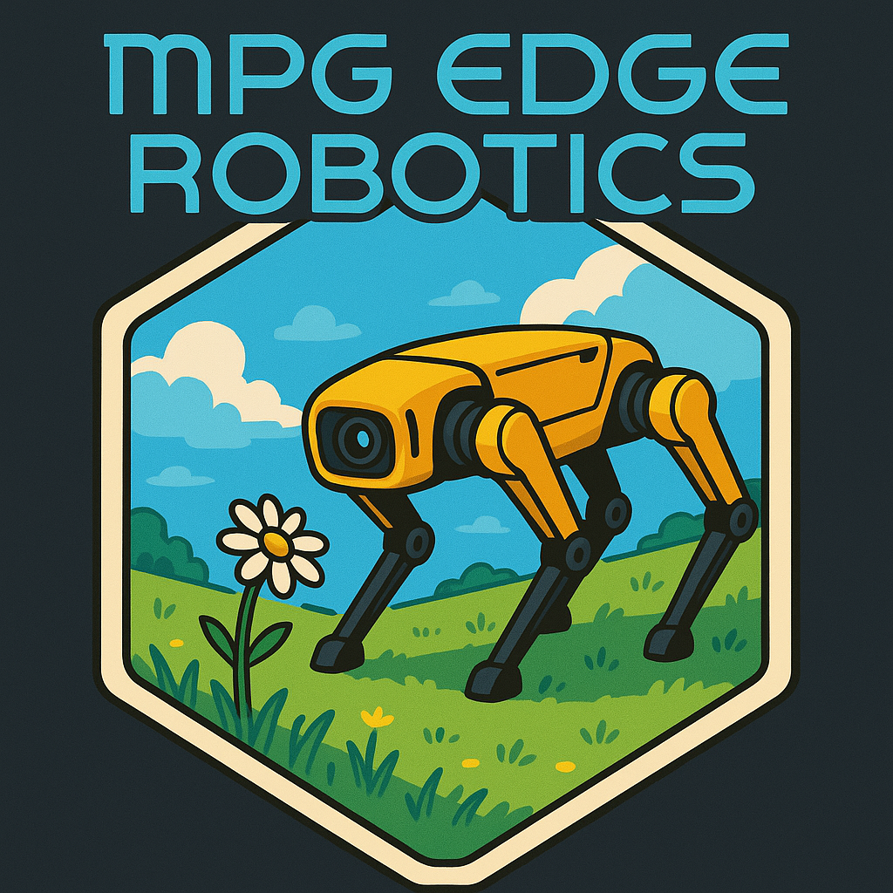

# go2_survey

Autonomous waypoint navigation for the **Unitree Go2** over **RTK GPS**. The
goal of the project is to develop a field-deployable surveying platform: the
robot walks itself between GPS waypoints at centimeter accuracy so downstream
sensing (cameras, environmental probes) can operate with precise geotagging.

The navigation stack is built from five moving parts, each behind its own
module under `src/go2_survey/`:

- **GPS** — u-blox ZED-F9P/F9R over UBX (`gps.py`)
- **NTRIP** — Emlid caster client that forwards RTCM corrections (`ntrip.py`)
- **Robot** — Go2 WebRTC connection + sport-state IMU + motion commands (`robot.py`)
- **Navigator** — three-phase state machine: calibrate IMU → turn → walk (`navigator.py`)
- **Mission runner** — loads a mission folder, runs it, calls hooks (`mission_runner.py`)

A single `go2-survey` CLI drives everything. Missions are **data**, not code:
each mission is a folder under `dev/missions/` containing a `mission.toml`, a
`waypoints.geojson`, and a thin `run.sh` wrapper.

## Quick start

```bash
pip install -e .                          # installs go2-survey + deps
go2-survey list                           # mission_00, mission_01, mission_02
go2-survey run mission_02 --dry-run       # load config + waypoints, skip hardware
go2-survey run mission_02                 # live navigation
```

Full walkthrough — including GPS wiring, NTRIP credentials, robot discovery,
and troubleshooting — lives in [`setup/install.md`](setup/install.md).

## Creating a new mission

```bash
cp -r dev/missions/_template dev/missions/mission_NAME
# edit dev/missions/mission_NAME/mission.toml (name, description)
# replace dev/missions/mission_NAME/waypoints.geojson with your FeatureCollection
go2-survey run mission_NAME
```

## Layout

```
mpg-ai-edge/
├── src/go2_survey/        # the installable package (ntrip, gps, robot,
│   │                      #   navigator, waypoints, geometry, config,
│   │                      #   mission_runner, cli, logging_utils)
│   └── vision/            # TODO: frame capture + geotagging
├── dev/
│   ├── missions/          # one folder per mission (data-driven)
│   │   ├── _template/
│   │   ├── mission_00/    # mission.toml + waypoints.geojson + run.sh + logs/
│   │   ├── mission_01/
│   │   └── mission_02/
│   ├── changelog.md       # dated log of what changed and why
│   ├── archive/           # retired scripts and historical logs
│   └── webrtc_docs/       # Go2 WebRTC protocol notes
├── setup/                 # install walkthrough + Jetson platform notes
├── scripts/               # find_robot_ip.sh and other operator helpers
├── pyproject.toml         # single source of truth for deps + entry point
└── README.md
```

## Roadmap

- **Frame capture** — pull still images from the Go2's WebRTC video track at
  each waypoint (`src/go2_survey/vision/frames.py`, currently a TODO)
- **Geotagging** — stamp captured frames with RTK position + calibrated heading
  for downstream inference pipelines (`vision/geotag.py`, also TODO)
- **Robot IP discovery as a Python module** — the current `scripts/find_robot_ip.sh`
  is an nmap-based shell scan; a portable Python port will live alongside the
  rest of the package
- **Tuned parameters per mission** — mission_00 and mission_01 still carry the
  pre-tuning defaults (0.2m tolerance, 0.3 m/s); they should migrate to the
  working mission_02 values (0.5m, 0.5 m/s) once retested in the field

## Project history

See [`dev/changelog.md`](dev/changelog.md) for the full dated log of changes,
including the bugs and fixes that produced the first successful autonomous
two-waypoint run on 2026-04-01.
