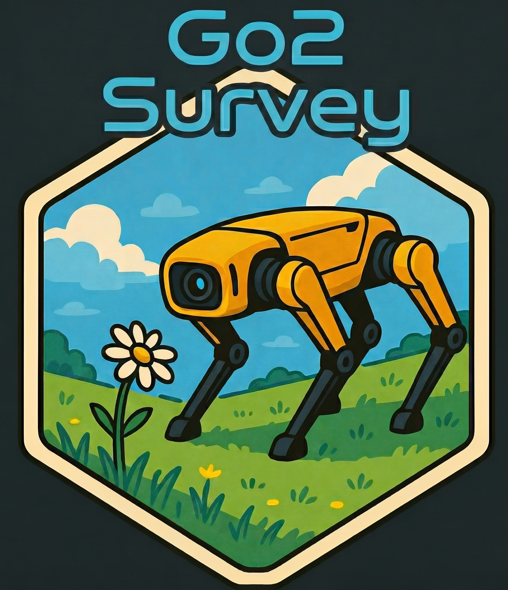

# go2_survey

Autonomous waypoint navigation for the **Unitree Go2** over **RTK GPS**. The
goal of the project is to develop a field-deployable surveying platform: the
robot walks itself between GPS waypoints at centimeter accuracy so downstream
sensing (cameras, environmental probes) can operate with precise geotagging.

The navigation stack is built from five moving parts, each behind its own
module under `src/go2_survey/`:

- **GPS** — u-blox ZED-F9P/F9R over UBX (`gps.py`)
- **NTRIP** — Emlid caster client that forwards RTCM corrections (`ntrip.py`)
- **Robot** — Go2 WebRTC connection + sport-state IMU + motion commands (`robot.py`)
- **Navigator** — three-phase state machine: calibrate IMU → turn → walk (`navigator.py`)
- **Mission runner** — loads a mission folder, runs it, calls hooks (`mission_runner.py`)

A single `go2-survey` CLI drives everything. Missions are **data**, not code:
each mission is a folder containing a `mission.toml` and a `waypoints.geojson`.
Run any mission with `go2-survey run <name|path>` — by name
(`go2-survey run 00_parking_lot`) if the folder lives under `dev/missions/`, or
by path (`go2-survey run /any/directory/with/a/mission.toml`) if it doesn't.

## Quick start

```bash
pip install -e .                          # installs go2-survey + deps
go2-survey list                           # 00_parking_lot, 01_tennis_court
go2-survey run 00_parking_lot --dry-run   # load config + waypoints, skip hardware
go2-survey run 00_parking_lot             # live navigation (parking lot circuit)
go2-survey discover-ip                    # find the Go2's IP on the local network
```

Full walkthrough — including GPS wiring, NTRIP credentials, robot discovery,
and troubleshooting — lives in [`setup/install.md`](setup/install.md).

## Creating a new mission

```bash
cp -r dev/missions/_template dev/missions/mission_NAME
# edit dev/missions/mission_NAME/mission.toml (name, description)
# replace dev/missions/mission_NAME/waypoints.geojson with your FeatureCollection
go2-survey run mission_NAME
```

## Anatomy of a mission

A mission is a directory containing exactly two files. The folder name is
your choice; the file names are load-bearing.

### `mission.toml`

TOML config. Two top-level fields plus four sections:

```toml
name        = "00_parking_lot"                   # used as log filename prefix
description = "Parking lot two-waypoint circuit" # human-readable

[gps]
port = "/dev/ttyACM0"     # USB serial port for the SparkFun ZED-F9P/F9R
baud = 38400

[ntrip]
host       = "caster.emlid.com"
port       = 2101
mountpoint = "MP15774"
username   = "u65352"
password   = "338zca"

[robot]
connection_mode = "LocalSTA"    # or "LocalAP" for the robot's own hotspot
# ip     = "192.168.1.105"      # optional; omit to auto-discover
# serial = "..."                # optional alternative to ip

[navigation]
arrival_tolerance = 0.5    # m     — stop when within this distance of a waypoint
max_velocity      = 0.5    # m/s   — forward speed cap
rotation_rate     = 0.8    # rad/s — angular speed during turns
min_fix_type      = 4      # 4=GNSS+DR, 5=RTK Float, 6=RTK Fixed
max_hacc          = 0.10   # m     — pause nav if horizontal accuracy degrades above this
gps_fix_timeout   = 300    # s     — max wait for initial fix
```

Every field is optional except `name`; unset fields fall back to the
dataclass defaults in `src/go2_survey/config.py`. Any field can also be
overridden at run time by an environment variable (`GPS_PORT`,
`EMLID_USERNAME`, `ROBOT_IP`, ...). Precedence:
**defaults → mission.toml → env var**.

### `waypoints.geojson`

Standard GeoJSON `FeatureCollection` of `Point` features. Coordinates are
`[longitude, latitude]` per the GeoJSON spec (not the reverse). A
`properties.name` field on each feature is optional but recommended —
it shows up in log lines as each waypoint is reached.

```json
{
  "type": "FeatureCollection",
  "features": [
    {
      "type": "Feature",
      "properties": { "name": "waypoint_1" },
      "geometry": { "type": "Point", "coordinates": [-113.99780057, 46.86164631] }
    }
  ]
}
```

`MultiPoint` geometries are also accepted — each inner coordinate becomes
its own `Waypoint` with a `_0`, `_1`, … suffix.

### What happens at runtime

`go2-survey run <mission>` loads `mission.toml`, applies env-var overrides,
and hands the resulting settings to `GPSManager`, `Go2Robot`, and
`WaypointNavigator`. It then loads `waypoints.geojson`, iterates the
waypoints in file order, and drives the robot through each one using the
three-phase state machine: **calibrate IMU → turn to heading → walk**.

Logs are written to `<mission>/logs/<name>_<timestamp>.log` alongside the
config, so every run's history co-locates with the mission that produced it.

## Layout

```
mpg-ai-edge/
├── src/go2_survey/        # the installable package (ntrip, gps, robot,
│   │                      #   navigator, waypoints, geometry, config,
│   │                      #   mission_runner, cli, discovery, logging_utils)
│   └── vision/            # TODO: frame capture + geotagging
├── dev/
│   ├── missions/          # one folder per mission (data-driven)
│   │   ├── _template/
│   │   ├── 00_parking_lot/  # parking lot circuit (2 waypoints, tuned settings)
│   │   └── 01_tennis_court/ # tennis court circuit (2 waypoints, tuned settings)
│   ├── changelog.md       # dated log of what changed and why
│   ├── archive/           # retired scripts and historical logs
│   └── docs/
│       ├── gps/           # u-blox ZED-F9R reference PDFs + config notes
│       └── webrtc/        # unitree_webrtc_connect protocol notes
├── setup/                 # install walkthrough + Jetson platform notes
├── pyproject.toml         # single source of truth for deps + entry point
└── README.md
```

## Roadmap

- **Frame capture** — pull still images from the Go2's WebRTC video track at
  each waypoint (`src/go2_survey/vision/frames.py`, currently a TODO)
- **Geotagging** — stamp captured frames with RTK position + calibrated heading
  for downstream inference pipelines (`vision/geotag.py`, also TODO)

## Project history

See [`dev/changelog.md`](dev/changelog.md) for the full dated log of changes,
including the bugs and fixes that produced the first successful autonomous
two-waypoint run on 2026-04-01.